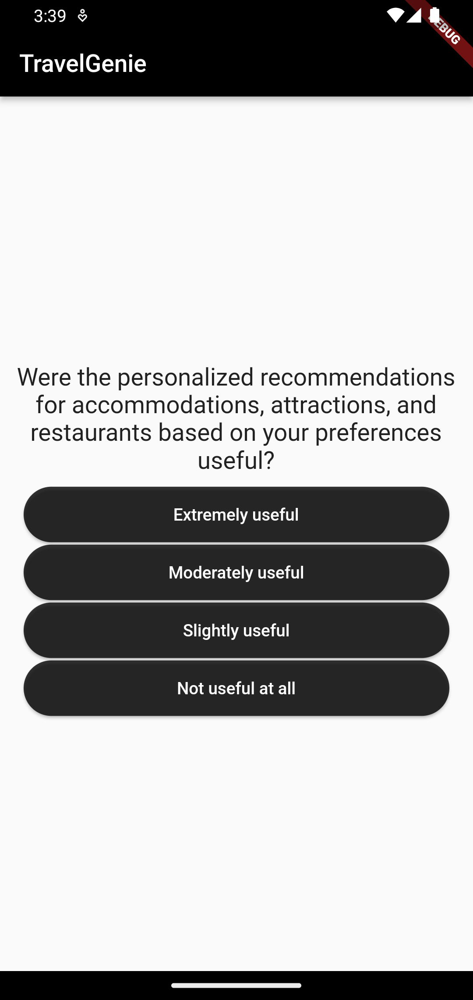
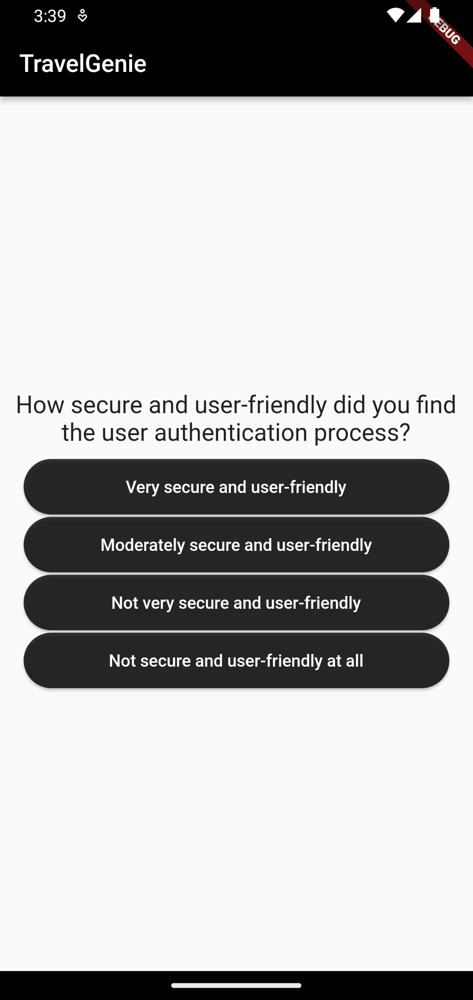
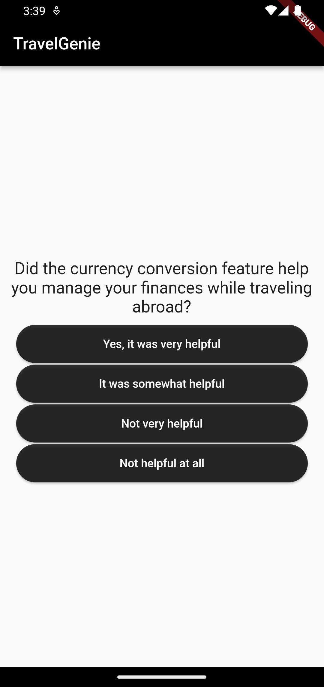
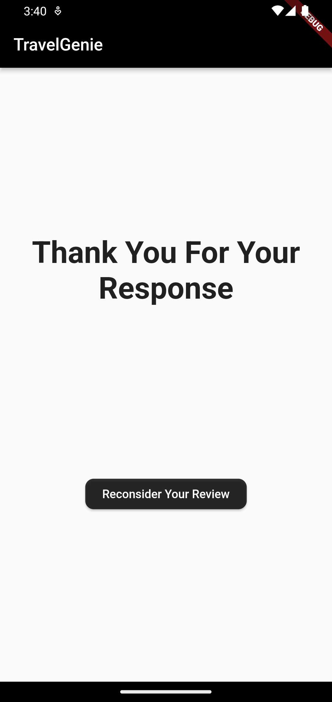
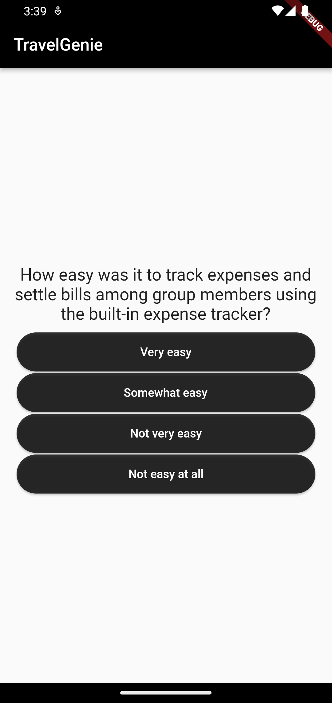
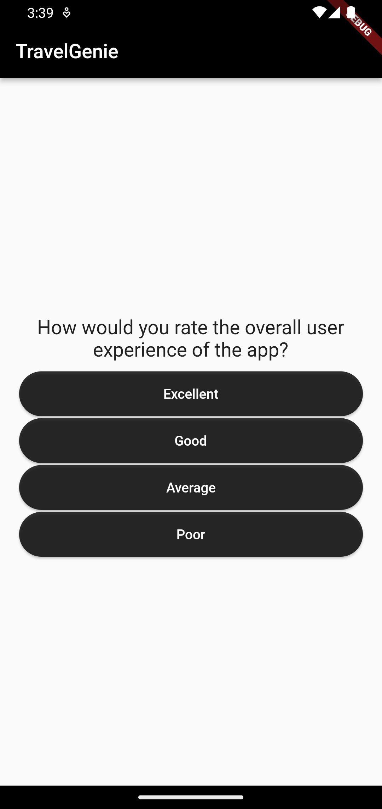

# Flutter Review the App

Welcome to the Flutter Review the App repository! This app is designed to collect user feedback and reviews about your app using Flutter. It presents a series of questions to the user, allowing them to rate different aspects of the app and provide comments. The app then generates a result based on the user's responses and saves the feedback for further analysis and improvement.

## Features

- **Review questions**: Present a set of questions to the user, allowing them to rate different aspects of the app.
- **Multiple-choice options**: Provide four options for each question, giving users a range of choices to select from.
- **Result generation**: Generate a result based on the user's responses, providing an overall rating or summary.
- **Comments and feedback**: Allow users to provide additional comments and feedback about the app.
- **Save user responses**: Save the user's feedback and responses for further analysis and improvement.
- **Simple and intuitive user interface**: Enjoy a visually appealing and user-friendly interface for a seamless reviewing experience.

## Screenshots

Here are some screenshots of the Flutter Review the App in action:

convert (screenshots/accomod.png) -resize 10x10 screenshots/accomod_resized.png

_Users can rate different aspects of the app by answering a series of questions._

_User authentication screen for secure access._

_User can select their preferred currency for calculations._

_Screen displayed at the end of the review process._

_User can rate the expense management feature of the app._

_User can rate their overall experience with the app._

_Screen showing the group chat feature of the app._

_User can rate the accuracy of the location feature._

<!-- . Feel free to use and modify the code to suit your needs.

## Acknowledgements

We would like to express our gratitude to the Flutter community for their continuous support and the developers of the libraries and packages used in this app.

If you have any questions or need further assistance, please feel free to contact us.

Gather valuable feedback and improve your app with the Flutter Review the App!
